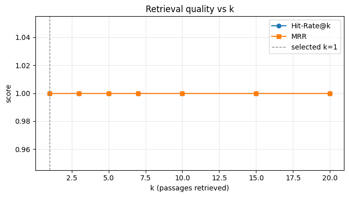
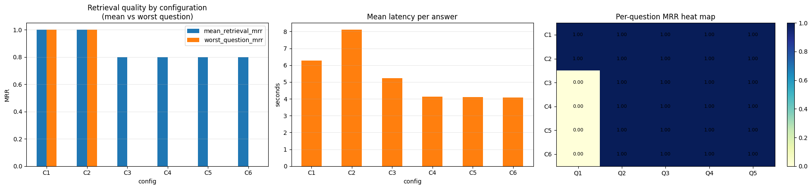
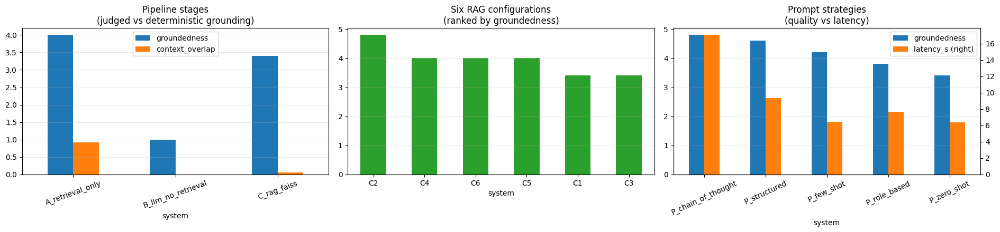

# Medical RAG Assistant — Grounded Q&A over the Merck Manual

A Retrieval-Augmented Generation (RAG) system that answers clinical questions **using only passages
retrieved from the Merck Manual of Diagnosis & Therapy (19th Edition)**, cites the source page for
every claim, and explicitly declines to answer when the manual doesn't contain the information. The
whole pipeline — chunking, embedding, indexing, generation and evaluation — is built and benchmarked
end-to-end in a single notebook, with every design choice (chunk size, index type, retrieval width,
re-ranking, fine-tuning, prompt strategy) picked from measured results rather than convention.

## Why this exists

Healthcare professionals face information overload: the Merck Manual runs to more than 4,000 pages
across 23 sections, and time-critical decisions can't wait on a manual lookup. A general-purpose LLM
can produce fluent, authoritative-sounding medical text while inventing dosages, protocols or
contraindications — a failure mode that's dangerous precisely because it's indistinguishable from a
correct answer at a glance. The primary success metric here is therefore **groundedness**, not
fluency.

## What's in the notebook

[`Medical_Questions_RAG.ipynb`](Medical_Questions_RAG.ipynb) — a 17-section, top-to-bottom-runnable
notebook (target: Colab T4 GPU) covering:

| # | Section |
|---|---|
| 1 | Environment setup (pinned deps, Colab T4 hardware detection) |
| 2 | PDF loading & boilerplate-stripping (watermarks, headers, licence text) |
| 3 | Chunking strategy — three configurations measured against each other |
| 4 | Embedding the corpus (`BAAI/bge-small-en-v1.5`) |
| 5 | FAISS vector index — flat vs. IVF vs. HNSW, benchmarked |
| 6 | Gold-set construction via paraphrase voting, with a verification gate |
| 7 | Retrieval quality measurement (hit-rate, MRR) and choice of `k` |
| 8 | Stage A — retrieval-only baseline (no LLM) |
| 9 | Stage B — LLM with no retrieval (the control condition) |
| 10 | Stage C — the full RAG pipeline (Mistral-7B-Instruct, grounded prompting) |
| 11 | Embedding fine-tuning experiment (and why it was rejected) |
| 12 | Cross-encoder re-ranking |
| 13 | Six-way RAG configuration comparison |
| 14 | Five-way prompt-strategy comparison (same retrieval, different prompts) |
| 15 | LLM-as-judge evaluation framework, calibrated before use |
| 16 | Consolidated results across every stage |
| 17 | Auto-generated insights & prioritised recommendations (computed from the run, not templated) |

**Models used:** `BAAI/bge-small-en-v1.5` (bi-encoder embeddings), `cross-encoder/ms-marco-MiniLM-L-6-v2`
(re-ranking), `Mistral-7B-Instruct-v0.2` GGUF (generator), `Qwen2.5-7B-Instruct` GGUF (LLM judge).

## Pipeline at a glance

```
PDF (4,114 pages)
   → clean text (boilerplate stripped, 7.4% noise removed)
   → chunk (medium: 600 chars / 150 overlap — chosen by measured MRR)
   → embed (bge-small-en-v1.5, 384-dim)
   → FAISS IndexFlatIP (29,129 vectors — exact search beats HNSW/IVF at this scale)
   → retrieve top-k passages for a question
   → prompt LLM: "answer using ONLY this context, cite pages, refuse if insufficient"
   → grounded, cited answer
```

## Results

### How much context to retrieve

Hit-rate and MRR stay perfectly flat from `k=1` through `k=20`, so the smallest sufficient value,
`k=1`, was selected — retrieving more only dilutes the prompt with text the model has to ignore.



### Comparing six retrieval configurations

Six configurations (baseline, wide retrieval, fine-tuned embeddings, cross-encoder re-ranking, and
combinations) were run against the same five questions. **Wide retrieval (`k=2`)** was the standout —
best mean and worst-case MRR, at the cost of ~2s extra latency.



### Consolidated view — stages, configs, and prompt strategies

| Comparison | Winner | Headline number |
|---|---|---|
| Pipeline stage | Stage A (retrieval-only) | 4.0 groundedness, 0.921 context overlap |
| RAG configuration | **C2 — wide retrieval (2k)** | 4.8 groundedness, 1.000 retrieval MRR |
| Prompt strategy | **Chain-of-thought** | 4.8 groundedness, 5.0 relevance |

The most decisive result: **Stage B (LLM with no retrieval at all) scored 1.0/5 groundedness with
0.000 context overlap** — despite producing the most fluent, confident-sounding answers of the whole
notebook. That's the entire argument for retrieval-augmented generation in one measurement, and it's
also what validated the LLM-as-judge: a judge that had rewarded Stage B's confidence instead of
penalizing its lack of grounding would have been useless.



### Other findings

- **Chunking:** medium chunks (600 chars) matched large chunks on MRR (1.00) while small chunks
  (400 chars) lagged at 0.85 — cutting a passage mid-thought hurts ranking.
- **Index choice:** exact search (`IndexFlatIP`) takes 22.9 ms/query over 29k vectors; HNSW is 2.1x
  faster but the saving doesn't justify giving up any recall at this corpus size.
- **Re-ranking:** the cross-encoder *hurt* mean MRR (1.000 → 0.800) in this run — it promoted a
  page FAISS had ranked #20 above the actual gold page for one question.
- **Embedding fine-tuning:** rejected. Overall MRR fell 1.000 → 0.800 and 2 of 4 unrelated topics
  regressed — a textbook case for always running a regression check, not just measuring the target
  topic.
- **Refusals:** 24.3% of all evaluated answers correctly refused rather than guessing — for a
  clinical tool, declining is the right behavior when the corpus doesn't contain the answer.

## Honest limitations (from the notebook's own validity check)

- **Gold set is not yet human-verified** — it was seeded from the system's own retrievals via
  paraphrase voting, so current MRR/hit-rate figures measure self-consistency rather than ground
  truth against the manual.
- **Sample size is 5 questions** — every comparison above is directional, not statistically
  significant.
- **No clinical validation.** This is a retrieval-and-evaluation demonstrator, **not a medical
  device**, and must not be used for patient care.

## Prioritised next steps (auto-generated from the run)

| Priority | Action | Why |
|---|---|---|
| P0 | Verify `GOLD_SET` against the manual | Every retrieval figure is provisional until this is done |
| P0 | Groundedness threshold + human escalation | Below-threshold answers must not reach a clinician unreviewed |
| P1 | Clinician-labelled gold set of 50–100 Q&A | Current sample is 5 questions |
| P1 | Hybrid retrieval (BM25 + FAISS) | Drug names/dosages are lexical; dense retrieval alone can miss exact terms |
| P1 | Re-scope or drop the embedding fine-tune | Overall MRR fell 1.000 → 0.800 |
| P2 | Domain-specific embedding model | A biomedical embedder handles clinical vocabulary better than a general one |
| P2 | Citation-linked UI | Clinicians must be able to open the cited page and verify |
| P2 | Migrate to `IndexIVFFlat` above ~1M vectors | Exact search is adequate at the current 29,129-vector scale |

## Running it

The notebook is written to run top-to-bottom, unattended, on a Colab T4 GPU:

1. Open `Medical_Questions_RAG.ipynb` in Google Colab.
2. Place the Merck Manual PDF in Google Drive and update `CONFIG["pdf_path"]` in Section 1 if needed.
3. Run all cells. Dependencies (FAISS, LangChain, sentence-transformers, PyMuPDF, llama-cpp-python)
   are installed by the first code cell; models are downloaded from Hugging Face on demand.
4. Section 6.2 has one manual step by design: confirm the gold-set pages against the manual and set
   `GOLD_VERIFIED = True` before trusting the retrieval metrics.

Outputs (per-stage/config/prompt evaluation CSVs, the FAISS index, and the run config) are written to
`results/` and `faiss_store/` when the notebook runs.

## Repository structure

```
.
├── Medical_Questions_RAG.ipynb   # the full pipeline: build, benchmark, evaluate
├── assets/plots/                 # plots referenced by this README
└── README.md
```
